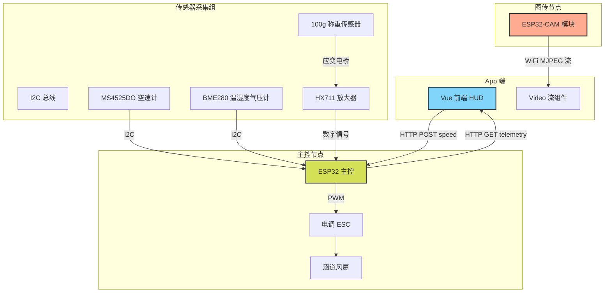

# 风洞硬件升级与数字孪生计划

根据最新的沟通，我们计划将现有的模拟风洞数据全面升级为基于真实物理传感器的采集系统，并加入实时内部监控视频流，具体升级方案如下：

## 1. 系统架构升级

目前的系统通过 ESP32 控制电调，手机 App 通过 WiFi 直连。升级后将增加数据采集与独立图传节点。

## 2. 硬件传感器清单与说明

为了替换现有的模拟数据，我们将引入以下三套核心硬件：

1.  **真实风速测量（流场动压）**
    *   **硬件**: `MS4525DO` 差压传感器模块（I2C 接口） + 皮托管
    *   **作用**: 读取动态风压，结合空气密度计算出极其精准的真实风速 (m/s) 替换目前的模拟值。
2.  **空气密度测量（环境静压与温湿度）**
    *   **硬件**: `BME280` 温湿度气压计模块 (3.3V 版本，I2C 接口)
    *   **作用**: 实时测量环境温度、湿度、绝对气压，用于推导流体密度，提升风速计算和风阻系数的精度。
3.  **汽车模型风阻力测量（受力）**
    *   **硬件**: `100g 微型平行梁称重传感器` + `HX711` 24位 A/D 转换模块
    *   **作用**: 测量汽车模型在风流中受到的微弱后推力（阻力），直接替换目前带有随机抖动的模拟阻力值。
4.  **实时监控画面（图传）**
    *   **硬件**: `ESP32-CAM` (DOIT 模组，带 OV2640 摄像头与烧录底板)
    *   **作用**: 独立提供风洞内部的实时 MJPEG 视频流，完全不占用主控 ESP32 的性能。
5.  **手动备用控制（可选安全件）**
    *   **硬件**: `MTS-102 钮子开关` (单刀双掷)
    *   **作用**: 物理切换电调 PWM 信号来源，实现 App 智能控制与物理旋钮（舵机测试仪）的一键切换。

## 3. 代码修改规划

接下来需要对两个工程进行代码改造：

### 3.1 ESP32 固件端 (`windtunnel_ap_controller.ino`)
*   **引入库文件**: 增加 `Wire.h`, `Adafruit_BME280.h` (或类似), `HX711.h` 以及针对 MS4525DO 的驱动库。
*   **引脚分配**: 
    *   分配一组 I2C 引脚 (如 SDA=21, SCL=22) 给 MS4525DO 和 BME280。
    *   分配两根 GPIO (如 DT=19, SCK=23) 给 HX711。
*   **数据采集循环**: 在 `loop()` 中非阻塞地、高频地读取这些传感器的数值，并进行单位换算（如 ADC 值转为 N 或 g）。
*   **遥测接口升级**: 在 `handleTelemetry()` 中，将读取到的真实物理量拼接到原本的 JSON 字符串中（如新增 `wind_speed_ms`, `static_press_pa`, `drag_force_n` 字段）。

### 3.2 独立图传端 (ESP32-CAM 模块)
*   烧录官方的 `CameraWebServer` 示例代码。
*   修改 WiFi 配置，使其作为客户端连接到主控开启的 `WindTunnel-ESP32` 热点。
*   配置固定静态 IP (如 `192.168.4.2`) 以便 App 固定请求。

### 3.3 App 前端 (Vue)
*   **状态管理 (`src/store/windTunnel.ts`)**: 
    *   扩展 `Esp32Telemetry` 类型以接收新的传感器字段。
    *   在 `pollTelemetryOnce` 中，当接收到新字段时，用真实数据覆盖掉现有的模拟物理逻辑（停止通过 `actualSpeedMs += ...` 模拟加减速）。
*   **UI 界面 (`src/App.vue`)**:
    *   在界面右侧或中间位置，新增一个用于展示监控画面的视频框。
    *   使用原生的 `` 标签，直接将 `src` 指向 `http://192.168.4.2:81/stream` 实现视频接入。